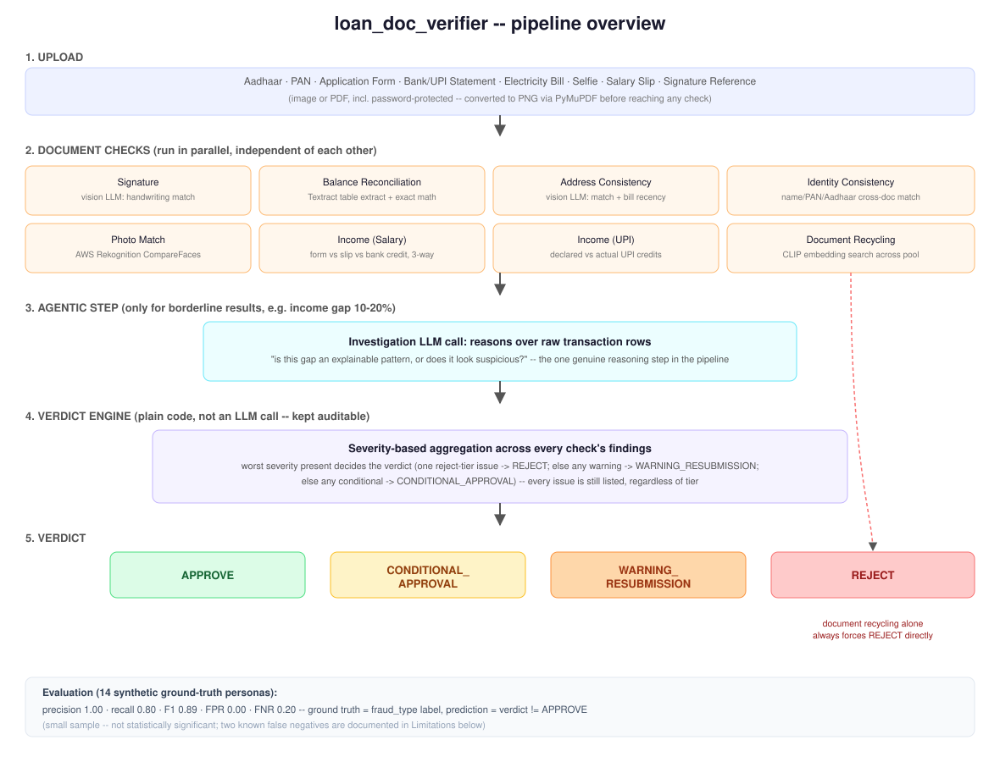

# Loan Document Verifier

An AI-driven loan-document fraud detection pipeline. Upload an applicant's documents (Aadhaar, PAN, application form, bank/UPI statement, electricity bill, selfie, salary slip, signature reference), and it runs eight independent checks, escalates borderline cases to an LLM reasoning step, and produces an auditable verdict with a full list of reasons.

**Live demo:** http://loan-doc-verifier-alb-742748483.ap-south-1.elb.amazonaws.com

Built as a hands-on demonstration of applied/agentic AI engineering: real document-understanding techniques (vision-LLM extraction, OCR table detection, face comparison, embedding search), a genuine agentic reasoning step used only where it's needed, a deliberately non-LLM rule engine for the final decision (auditability), and a deployed, CI/CD-backed AWS service rather than a notebook demo.

## Architecture



1. **Upload** -- documents arrive as images or PDFs (including password-protected bank statement PDFs); everything is normalized to PNG before any check runs.
2. **Document checks (parallel)** -- eight independent checks, each using whichever tool actually fits the document type (see below).
3. **Agentic investigation** -- only triggered for borderline results (e.g. an income gap of 10-20%, not clearly clean or clearly fraudulent). An LLM reasons over the raw underlying transaction rows and judges whether the pattern looks explainable or suspicious. This is the one place in the pipeline where an LLM makes a judgment call rather than extracting data.
4. **Verdict engine** -- plain Python, not an LLM call. Every check's findings are collected with a severity tier (reject / warning / conditional); the worst severity present decides the overall verdict, but every issue found is still listed regardless of tier, so nothing is silently dropped.
5. **Verdict** -- `APPROVE`, `CONDITIONAL_APPROVAL`, `WARNING_RESUBMISSION`, or `REJECT`, each with the full list of reasons. Document recycling (a signature reused across unrelated applicants) is treated as an automatic `REJECT` regardless of anything else, since it implies the applicant pool itself has been compromised.

## The eight checks

| Check | How |
|---|---|
| Signature | Vision LLM judges handwriting similarity between the form's signature and a reference specimen, allowing for natural variation. |
| Balance reconciliation | AWS Textract table extraction on the bank statement, then exact arithmetic (previous balance + amount == next balance) in plain code -- no model judgment needed once the numbers are extracted. |
| Address consistency | Vision LLM compares the address on the application form against the electricity bill, and separately checks the bill isn't stale (issued too long before the application to count as proof of current residence). |
| Identity consistency | Cross-checks name/PAN/Aadhaar across the application form, Aadhaar card, PAN card, and electricity bill. Uses PAN/Aadhaar's fixed public format to deterministically correct common OCR letter/digit misreads, and routes small ("near-miss") name differences to manual review rather than guessing whether they're OCR noise or real fraud. |
| Photo match | AWS Rekognition `CompareFaces` between the Aadhaar photo and a live selfie -- a purpose-built face-matching service rather than an LLM judgment call. |
| Income (salaried) | Three-way reconciliation: declared income (form) vs. net salary (payslip) vs. actual salary credits (bank statement). |
| Income (self-employed) | Declared income vs. actual credits extracted from UPI transaction history (Google Pay / PhonePe / Paytm), excluding transactions tagged personal. |
| Document recycling | CLIP embeddings (via ChromaDB) find each applicant's closest signature match across the whole applicant pool; only the closest candidate gets a precise vision-LLM confirmation, so this scales without comparing every pair directly. 

## Tech stack

Python 3.12, uv for dependency management, Streamlit for the UI, OpenAI GPT-4o for vision extraction and reasoning, AWS Textract for table extraction, AWS Rekognition for face comparison, ChromaDB + `sentence-transformers` (CLIP) for embedding search, PyMuPDF for PDF handling. Deployed as a Docker container on AWS ECS Fargate behind an Application Load Balancer, with GitHub Actions building and pushing to ECR and forcing a new ECS deployment on every push to `main`.

## Running locally

```
git clone <repo>
cd loan_doc_verifier
uv sync
# add a .env with OPENAI_API_KEY and AWS credentials
uv run streamlit run app.py
```

## Evaluation

Ground truth is the `fraud_type` label baked into the 14 synthetic test personas (`data/ground_truth/personas.json`) -- 4 clean, 10 fraudulent, each representing a distinct fraud pattern. Prediction = whether the pipeline's final verdict was anything other than `APPROVE`.

```
precision = 1.00   (every flagged application was actually fraudulent)
recall    = 0.80   (2 of 10 fraud cases slipped through as APPROVE)
F1        = 0.89
FPR       = 0.00   (no clean applicant was wrongly flagged)
FNR       = 0.20
```

Run it yourself: `uv run python experiments/08_eval_metrics.py`

This is a small, synthetic sample -- the numbers are useful as a concrete, honest snapshot of current behavior, not a statistically meaningful claim. It also only scores whether an application was flagged at all, not whether the severity tier (REJECT vs. WARNING_RESUBMISSION) was the right call, since ground truth here doesn't encode an expected severity.

## Known limitations

- **Two documented false negatives**: `P004_doc_tamper_careful` and `P009_fully_fabricated` currently pass as `APPROVE`. Both involve fabrication styles subtle enough that none of the eight checks individually catch them.
- **Large, real multi-page bank statements** can still produce corrupted row extraction at internal chunking boundaries. A partial mitigation (discarding rows near Textract's own chunk edges) didn't fully resolve it on a real 23-page statement; the likely root cause (zero-gap PDF page stacking before chunking) is identified but not yet fixed.
- **Identity check can't distinguish OCR noise from single-character identity fraud** -- both produce the same edit-distance signature, so small name differences are routed to manual review rather than an automatic verdict either way.
- **Address proof is assumed to be in the applicant's own name** -- real households sometimes have utility bills registered to a family member; this isn't handled.
- **No authentication on the public demo URL**, and the ECS task's security group currently accepts inbound traffic on its app port from anywhere rather than being restricted to the load balancer only -- both acceptable for a portfolio demo, not for production.
- **No groundedness check** on the two LLM reasoning surfaces (the investigation step, and the chat Q&A in the UI) -- nothing currently verifies that generated reasoning is actually supported by the underlying data, beyond spot-checking by hand.
